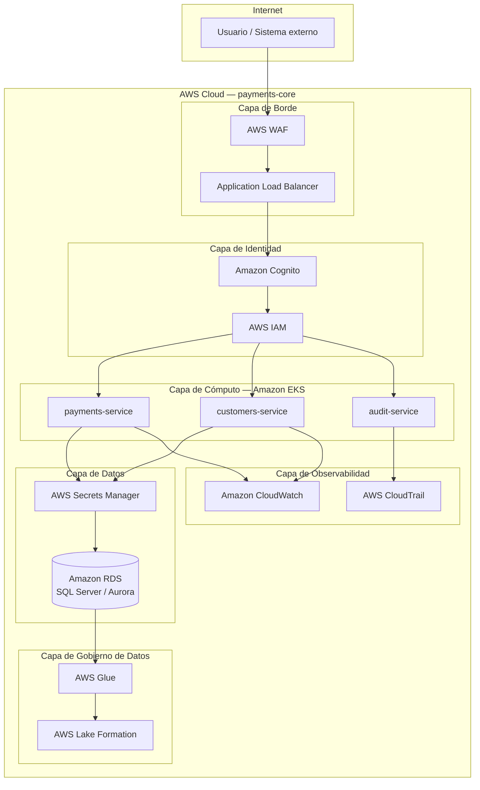

# Arquitectura Objetivo — payments-core en AWS
**Bank Modernization Readiness Advisor** | Kiro + AWS MCP | Marzo 2026 | Confidencial

---

## Dashboard Ejecutivo de Arquitectura

| Indicador | Estado Actual | Estado Objetivo |
|---|---|---|
| Arquitectura | Monolito on-premise | Microservicios cloud-native en AWS |
| Base de datos | SQL Server on-premise | Amazon RDS / Aurora PostgreSQL |
| Autenticación | Sin capa de autenticación | Amazon Cognito + AWS IAM |
| Gestión de secretos | Credenciales en código | AWS Secrets Manager |
| Monitoreo | Sin observabilidad | Amazon CloudWatch + AWS CloudTrail |
| Protección perimetral | Sin WAF | AWS WAF + Application Load Balancer |
| Gobierno de datos | Sin catálogo ni políticas | AWS Glue + AWS Lake Formation |
| Cloud Readiness | 38 / 100 🔴 | ≥ 75 / 100 🟢 (objetivo post-migración) |

---

## Estado Actual vs Estado Objetivo

| Dimensión | Estado Actual | Estado Objetivo |
|---|---|---|
| Cómputo | Servidor on-premise | Amazon EKS (contenedores gestionados) |
| Base de datos | SQL Server NTTD-HHM6P74 | Amazon RDS for SQL Server o Aurora PostgreSQL |
| Conectividad | Conexión directa sin abstracción | Application Load Balancer + API Gateway |
| Seguridad perimetral | Sin protección | AWS WAF con reglas para banca |
| Identidad y acceso | Sin IAM | AWS IAM + Amazon Cognito |
| Secretos | Hardcodeados en código fuente | AWS Secrets Manager |
| Observabilidad | Sin monitoreo | Amazon CloudWatch + AWS CloudTrail |
| Calidad de datos | Sin gobierno | AWS Glue + AWS Lake Formation |
| Escalabilidad | Vertical (limitada) | Horizontal automática (EKS autoscaling) |
| Disponibilidad | Sin SLA definido | Multi-AZ — objetivo ≥ 99.9% (sujeto a diseño final) |

---

## Diagrama de Arquitectura Objetivo

---

## Arquitectura en Capas

### Capa 1 — Borde y Protección Perimetral

| Servicio | Función | Beneficio |
|---|---|---|
| AWS WAF | Filtrado de tráfico malicioso | Protección contra OWASP Top 10, ataques a APIs bancarias |
| Application Load Balancer | Distribución de carga y routing | Alta disponibilidad, health checks, SSL termination |

### Capa 2 — Identidad y Acceso

| Servicio | Función | Beneficio |
|---|---|---|
| Amazon Cognito | Autenticación de usuarios y sistemas | Mitiga gap `no_auth_layer` — requiere validación en fase de implementación |
| AWS IAM | Control de acceso granular a recursos AWS | Principio de mínimo privilegio para todos los servicios |

### Capa 3 — Cómputo Cloud-Native

| Servicio | Función | Beneficio |
|---|---|---|
| Amazon EKS | Orquestación de contenedores | Escalabilidad horizontal, despliegues sin downtime |
| payments-service | Lógica de procesamiento de pagos | Microservicio independiente y desplegable |
| customers-service | Gestión de datos de clientes | Separación de dominios, cumplimiento GDPR |
| audit-service | Registro de operaciones | Mitiga gap `no_audit_log` — contribuye al cumplimiento SOX |

### Capa 4 — Datos

| Servicio | Función | Beneficio |
|---|---|---|
| Amazon RDS for SQL Server | Base de datos gestionada | Backups automáticos, Multi-AZ, parches gestionados |
| Aurora PostgreSQL (alternativa) | Base de datos cloud-native | Mayor compatibilidad con ecosistema AWS |
| AWS Secrets Manager | Gestión de credenciales | Mitiga gap `no_secrets_manager` — permite rotación automática de credenciales |

### Capa 5 — Gobierno de Datos

| Servicio | Función | Beneficio |
|---|---|---|
| AWS Glue | ETL y catálogo de datos | Linaje de datos, transformaciones, integración con Lake Formation |
| AWS Lake Formation | Gobierno centralizado de datos | Control de acceso a datos sensibles, cumplimiento PCI-DSS / GDPR |

### Capa 6 — Observabilidad y Auditoría

| Servicio | Función | Beneficio |
|---|---|---|
| Amazon CloudWatch | Monitoreo de métricas y logs | Alertas en tiempo real, dashboards operativos |
| AWS CloudTrail | Auditoría de acciones en AWS | Trazabilidad completa para SOX y Basel |

---

## Beneficios Esperados

| Beneficio | Métrica objetivo | Plazo |
|---|---|---|
| Disponibilidad del sistema | Objetivo ≥ 99.9% Multi-AZ (sujeto a diseño final) | Post Fase 3 |
| Tiempo de despliegue | < 30 minutos (CI/CD) | Post Fase 4 |
| Cloud Readiness score | ≥ 75 / 100 | Post Fase 4 |
| Reducción de riesgo de seguridad | Security Risk ≤ 40 / 100 | Post Fase 2–3 |
| Reducción de riesgo regulatorio | Compliance Risk ≤ 40 / 100 | Post Fase 5 |
| Calidad de datos | Data Quality ≥ 60 / 100 | Post Fase 2 |
| Escalabilidad | Horizontal automática sin intervención manual | Post Fase 3 |
| Costo operativo | Reducción estimada 15–30% vs on-premise (dependiendo del uso) | Post Fase 3 |

---

## Riesgos Mitigados por la Arquitectura Objetivo

| Riesgo actual | Mitigación en arquitectura objetivo | Servicio AWS |
|---|---|---|
| Credenciales en código fuente | Permite controlar el riesgo mediante rotación automática de secretos | AWS Secrets Manager |
| Sin autenticación de usuarios | Reduce el riesgo con autenticación federada y MFA | Amazon Cognito |
| Sin audit log | Reduce el riesgo con registro estructurado de operaciones | AWS CloudTrail |
| Conexión directa a base de datos | Mitiga el gap con acceso mediado por IAM y Secrets Manager | AWS IAM + Secrets Manager |
| Sin protección perimetral | Reduce la exposición con WAF y reglas para banca | AWS WAF |
| Sin monitoreo operativo | Mejora la visibilidad con alertas y dashboards en tiempo real | Amazon CloudWatch |
| Datos sin gobierno | Permite controlar el acceso con catálogo y linaje de datos | AWS Glue + Lake Formation |
| Arquitectura monolítica | Reduce el acoplamiento mediante microservicios en EKS | Amazon EKS |

---

## Principios de Arquitectura Aplicados

| Principio | Descripción | Implementación |
|---|---|---|
| Seguridad por diseño | Controles de seguridad en cada capa | WAF → ALB → Cognito → IAM → Secrets Manager |
| Mínimo privilegio | Cada servicio accede solo a lo que necesita | AWS IAM con políticas granulares por microservicio |
| Separación de responsabilidades | Dominios de negocio independientes | Microservicios: payments, customers, audit |
| Observabilidad completa | Todo evento es registrado y monitoreable | CloudWatch + CloudTrail en todas las capas |
| Resiliencia y disponibilidad | Sin punto único de falla | Multi-AZ en RDS, EKS con múltiples nodos |
| Gobierno de datos | Datos sensibles controlados y trazables | Lake Formation + Glue para datos de pago |
| Automatización | Infraestructura como código, CI/CD | AWS CodePipeline + CloudFormation / Terraform |

---

## Gobierno de Datos en la Arquitectura

| Capacidad | Servicio | Marco regulatorio |
|---|---|---|
| Catálogo de datos centralizado | AWS Glue Data Catalog | SOX, Basel |
| Control de acceso a datos sensibles | AWS Lake Formation | PCI-DSS, GDPR |
| Linaje y trazabilidad de datos | AWS Glue + Lake Formation | SOX, Basel |
| Clasificación de datos personales | AWS Macie | GDPR |
| Monitoreo de calidad continuo | CloudWatch + reglas DQ | PCI-DSS, SOX |
| Retención y eliminación de datos | S3 Lifecycle + RDS automated backups | GDPR |

---

## Resumen para Dirección

La arquitectura objetivo orienta la evolución de payments-core desde un monolito on-premise con exposición de seguridad relevante hacia una plataforma cloud-native en AWS, con controles de seguridad, gobierno de datos y observabilidad integrados desde el diseño.

Los cuatro gaps de seguridad identificados en el assessment (`no_auth_layer`, `no_audit_log`, `direct_db_connection`, `no_secrets_manager`) son abordados estructuralmente por la arquitectura propuesta. La efectividad de cada control requiere validación durante la fase de implementación y pruebas antes del corte a producción.

La migración se ejecuta en fases, reduciendo el riesgo operativo y permitiendo validar cada capa antes de avanzar. El objetivo es alcanzar un Cloud Readiness score ≥ 75/100 y reducir el riesgo de seguridad y compliance a niveles aceptables para operación bancaria regulada.

---

## Consideraciones de Migración

La transición hacia la arquitectura objetivo no es un evento único sino un proceso incremental que debe gestionarse con cuidado en un entorno bancario regulado.

| Consideración | Descripción |
|---|---|
| Migración incremental | Cada capa se migra y valida de forma independiente antes de avanzar a la siguiente fase |
| Coexistencia on-premise + AWS | Durante las fases iniciales (1–3), el sistema legacy y la infraestructura AWS operarán en paralelo |
| Arquitectura híbrida temporal | Se prevé un período de arquitectura híbrida mientras se validan los servicios AWS en entorno bancario |
| Validación regulatoria previa a producción | Los controles PCI-DSS, SOX y GDPR deben ser validados por el equipo de compliance antes del corte definitivo |
| Pruebas de performance antes del corte | Se requieren pruebas de carga y latencia sobre la arquitectura AWS antes de migrar tráfico de producción |
| Plan de rollback | Cada fase debe contar con un plan de reversión documentado en caso de incidentes durante la migración |

---

*Documento generado por Bank Modernization Readiness Advisor — Kiro + AWS MCP*
*Evidencia: `inventory.json` · `readiness_score.json` · código fuente `/app`*
